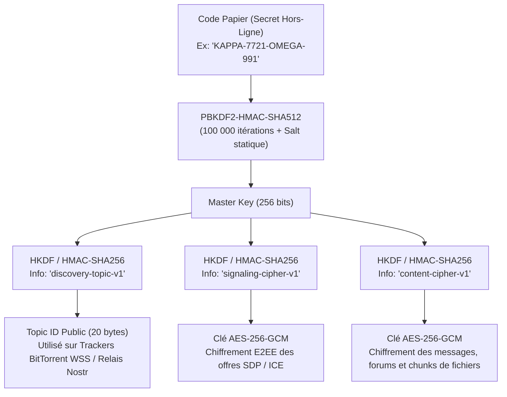

# Dossier d'Analyse Fonctionnelle & Use Cases : Extension Chrome P2P Mesh

Ce document présente l'analyse fonctionnelle complète, la décomposition des cas d'utilisation (Use Cases, Sous-Use Cases et Sous-Sous-Use Cases), les modèles d'états et les flux opérationnels de l'application collaborative décentralisée **P2P Mesh Workspace**.

---

## 1. Vision & Périmètre du Système

### 1.1 Objectif
Fournir un espace de travail collaboratif sécurisé, sans aucune infrastructure serveur propriétaire, opérant directement dans le navigateur Google Chrome (Manifest V3) à travers un maillage Peer-to-Peer (WebRTC).

### 1.2 Acteurs du Système
- **Utilisateur Local (Membre)** : Tout utilisateur ayant installé l'extension et possédant un Code Papier d'accès.
- **Pair Distant (Peer)** : Autre membre du même groupe connecté au réseau maillé WebRTC.
- **Relais Public (Tracker WSS / Relais Nostr)** : Point de rencontre neutre et éphémère servant uniquement au signalement initial (aveugle aux données).

---

## 2. Décomposition Hiérarchique des Cas d'Utilisation (Use Cases)

```
UC-1 : Authentification & Gestion des Identités
  ├── SUC-1.1 : Création d'un Nouveau Groupe
  │     ├── SSUC-1.1.1 : Génération de la phrase secrète maîtresse (12 mots / Code alphanumérique)
  │     ├── SSUC-1.1.2 : Dérivation locale des clés de chiffrement AES-256-GCM et du Topic ID
  │     └── SSUC-1.1.3 : Génération de la fiche papier de sécurité (impression / copie)
  └── SUC-1.2 : Rejoindre un Groupe Existant
        ├── SSUC-1.2.1 : Saisie / Collage du Code Papier
        ├── SSUC-1.2.2 : Validation du format et normalisation (trim, lowercase, checksum)
        ├── SSUC-1.2.3 : Dérivation cryptographique PBKDF2/HKDF (Zero-Knowledge)
        └── SSUC-1.2.4 : Définition du profil local (Pseudonyme, Avatar génératif, Clé Ed25519)

UC-2 : Réseau P2P & Présence Décentralisée
  ├── SUC-2.1 : Signalement & Découverte Sans Serveur
  │     ├── SSUC-2.1.1 : Connexion multi-relais WebSockets (BitTorrent Trackers & Nostr)
  │     ├── SSUC-2.1.2 : Chiffrement E2EE des offres et réponses WebRTC (SDP / ICE)
  │     └── SSUC-2.1.3 : Établissement direct de la RTCPeerConnection
  ├── SUC-2.2 : Gestion de la Topologie Mesh (Maillage)
  │     ├── SSUC-2.2.1 : Ouverture des canaux de données RTCDataChannel (Canal Texte, Canal Fichier)
  │     ├── SSUC-2.2.2 : Détection et intégration automatique des nouveaux pairs entrants
  │     └── SSUC-2.2.3 : Nettoyage des pairs déconnectés et libération des ressources
  └── SUC-2.3 : Présence & Télémétrie P2P
        ├── SSUC-2.3.1 : Protocole de Heartbeat PING/PONG (5s)
        ├── SSUC-2.3.2 : Calcul du temps d'aller-retour RTT (latence en millisecondes)
        └── SSUC-2.3.3 : Affichage du roster dynamique (statut en ligne, inactif, orateur)

UC-3 : Messagerie Instantanée & Forums Synchronisés (CRDT)
  ├── SUC-3.1 : Salons de Discussion Publics (Channels)
  │     ├── SSUC-3.1.1 : Envoi et diffusion immédiate d'un message texte (Gossip Protocol)
  │     ├── SSUC-3.1.2 : Formatage Markdown léger, horodatage logique et statut de remise
  │     ├── SSUC-3.1.3 : Réactions émojis répliquées
  │     └── SSUC-3.1.4 : Indicateurs de frappe en temps réel
  ├── SUC-3.2 : Messages Directs Privés (1:1 DMs)
  │     ├── SSUC-3.2.1 : Chiffrement E2EE supplémentaire spécifique à la paire de membres
  │     └── SSUC-3.2.2 : Notification visuelle et sonore de message reçu
  ├── SUC-3.3 : Forums Thématiques & Fils de Discussion (Threads)
  │     ├── SSUC-3.3.1 : Création d'un sujet (Titre, Catégorie, Corps, Tags)
  │     ├── SSUC-3.3.2 : Réponses imbriquées (arborescence)
  │     └── SSUC-3.3.3 : Statut du sujet (Épinglé, Résolu, Ouvert)
  └── SUC-3.4 : Réconciliation Hors-Ligne (Catch-up Sync)
        ├── SSUC-3.4.1 : Échange du StateVector CRDT à la reconnexion
        ├── SSUC-3.4.2 : Calcul du différentiel binaire (Delta Update)
        └── SSUC-3.4.3 : Fusion déterministe sans conflit (LWW-Element-Set)

UC-4 : Drive Partagé P2P & Versioning Merkle DAG
  ├── SUC-4.1 : Téléversement & Découpage Local (Chunking)
  │     ├── SSUC-4.1.1 : Glisser-déposer de fichiers de toute taille
  │     ├── SSUC-4.1.2 : Découpage binaire en blocs réguliers de 512 Ko
  │     ├── SSUC-4.1.3 : Calcul du hash SHA-256 par bloc et construction de l'Arbre Merkle
  │     └── SSUC-4.1.4 : Stockage des blocs dans OPFS (Origin Private File System)
  ├── SUC-4.2 : Versioning Type Git (Commit DAG)
  │     ├── SSUC-4.2.1 : Création d'un snapshot immuable (Hash du Commit, Parent, Message)
  │     ├── SSUC-4.2.2 : Dédoublonnage intelligent (seuls les blocs modifiés sont stockés)
  │     ├── SSUC-4.2.3 : Arbre chronologique interactif des versions
  │     └── SSUC-4.2.4 : Restauration immédiate (Revert) vers une version antérieure
  └── SUC-4.3 : Téléchargement en Essaim (Swarm Downloader)
        ├── SSUC-4.3.1 : Récupération de l'index des fichiers et commits via CRDT
        ├── SSUC-4.3.2 : Requêtes parallèles des blocs manquants auprès des pairs disponibles
        ├── SSUC-4.3.3 : Vérification d'intégrité SHA-256 de chaque bloc reçu
        ├── SSUC-4.3.4 : Assemblage binaire final et téléchargement local (Save As)
        └── SSUC-4.3.5 : Gestion du contrôle de flux (Backpressure) pour éviter le débordement mémoire

UC-5 : Salons Vocaux & Vidéo (WebRTC Mesh)
  ├── SUC-5.1 : Salons Vocaux P2P (Voice Rooms)
  │     ├── SSUC-5.1.1 : Capture audio haute définition (Opus 48kHz, suppression de bruit)
  │     ├── SSUC-5.1.2 : Détection d'Activité Vocale (VAD) et contour lumineux d'orateur
  │     ├── SSUC-5.1.3 : Visualiseur de spectre audio en temps réel sur Canvas HTML5
  │     └── SSUC-5.1.4 : Contrôles : Couper/Rétablir le micro (Mute/Unmute)
  ├── SUC-5.2 : Salons Vidéo P2P (Video Mesh Rooms)
  │     ├── SSUC-5.2.1 : Capture caméra (720p/360p adaptatif selon le nombre de pairs)
  │     ├── SSUC-5.2.2 : Négociation et injection des pistes vidéo dans les PeerConnections
  │     ├── SSUC-5.2.3 : Mosaïque responsive et affichage de l'orateur principal
  │     └── SSUC-5.2.4 : Activation/Désactivation de la vidéo en un clic
  ├── SUC-5.3 : Partage d'Écran P2P
  │     ├── SSUC-5.3.1 : Capture d'onglet, fenêtre ou écran complet via getDisplayMedia
  │     └── SSUC-5.3.2 : Remplacement transparent de la piste vidéo caméra par l'écran
  └── SUC-5.4 : Tâche de Fond & Continuité
        ├── SSUC-5.4.1 : Relais audio via le document Offscreen pour préserver l'appel
        └── SSUC-5.4.2 : Indicateurs visuels dans le badge de l'extension
```

---

## 3. Modèle de Données Conceptuel (Structures JSON-LD / Immuables)

### 3.1 Paquet de Message de Chat (`ChatMessage`)
```json
{
  "id": "msg_98a7b6c5d4e3",
  "channelId": "general",
  "authorPubkey": "04a1b2c3d4...",
  "authorName": "Alice",
  "content": "Bonjour à tous sur le réseau maillé !",
  "lamportTime": 42,
  "timestamp": 1787223000000,
  "signature": "3045022100...",
  "reactions": { "👍": ["Alice", "Bob"] }
}
```

### 3.2 Paquet de Fil de Forum (`ForumThread`)
```json
{
  "id": "thread_12f34e56",
  "title": "Spécifications de la version 2.0",
  "category": "Architecture",
  "authorPubkey": "04a1b2c3d4...",
  "authorName": "Alice",
  "content": "Voici le détail des propositions pour le protocole de swarm.",
  "createdAt": 1787223000000,
  "tags": ["p2p", "crdt", "spec"],
  "isPinned": true,
  "isResolved": false,
  "replies": [
    {
      "id": "reply_789abc",
      "authorName": "Bob",
      "content": "Excellente idée, je valide la découpe en 512 Ko.",
      "timestamp": 1787223500000
    }
  ]
}
```

### 3.3 Paquet de Commit de Fichier (`DriveCommit`)
```json
{
  "commitId": "commit_e4b8a2c1",
  "fileId": "file_dossier_technique_pdf",
  "fileName": "dossier_technique.pdf",
  "fileSize": 5242880,
  "mimeType": "application/pdf",
  "parentCommitId": "commit_a1b2c3d4",
  "versionNumber": 2,
  "authorName": "Alice",
  "commitMessage": "Ajout des schémas d'architecture et correction typo",
  "timestamp": 1787224000000,
  "rootMerkleHash": "7f83b1657ff1fc53b92dc18148a1d65dfc2d4b1fa3d677284addd200126d9069",
  "chunks": [
    { "index": 0, "hash": "e3b0c44298fc1c149afbf4c8996fb92427ae41e4649b934ca495991b7852b855", "size": 524288 },
    { "index": 1, "hash": "ca978112ca1bbdcafac231b39a23dc4da786081496a83e0c466ebc164d12c019", "size": 524288 }
  ]
}
```

---

## 4. Modèle de Sécurité & Cryptographie



- **Zero-Knowledge** : Les relais publics ne connaissent ni la clé ni le nom des canaux.
- **Authentification forte** : Tout pair incapable de déchiffrer les paquets de signalement est automatiquement rejeté.
- **Intégrité binaire** : Chaque bloc de données du drive est vérifié par SHA-256 à la volée.
